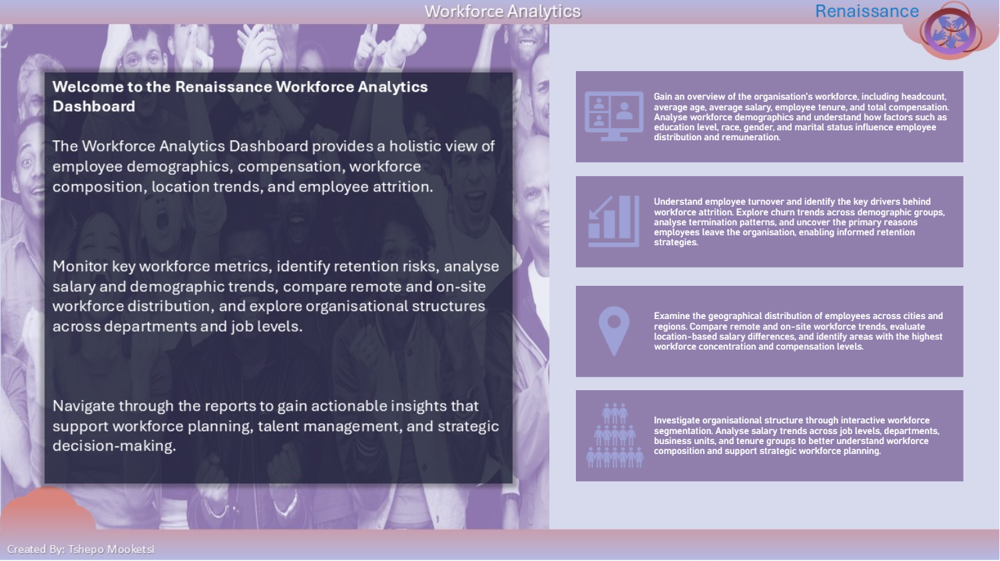
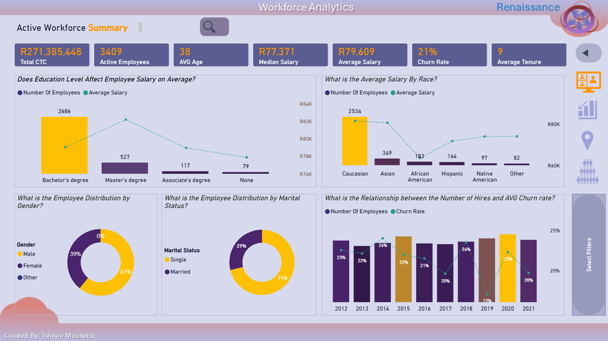
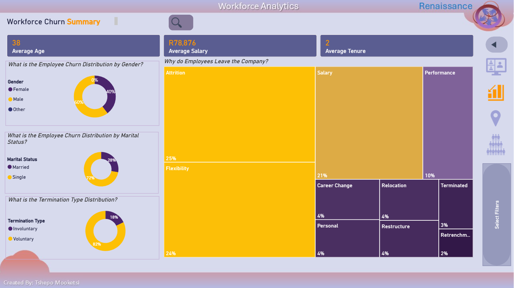
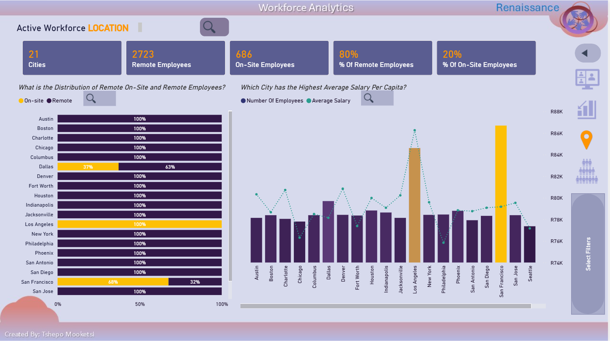
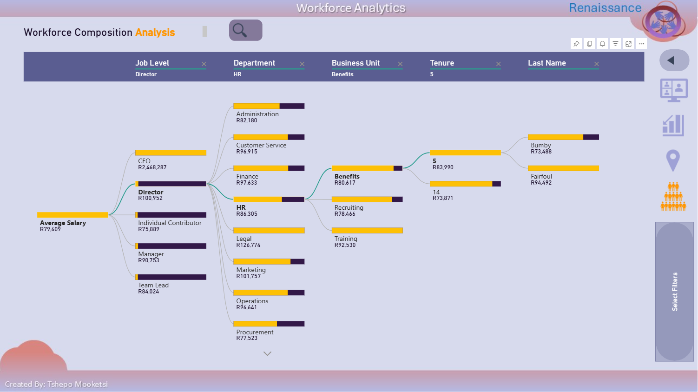
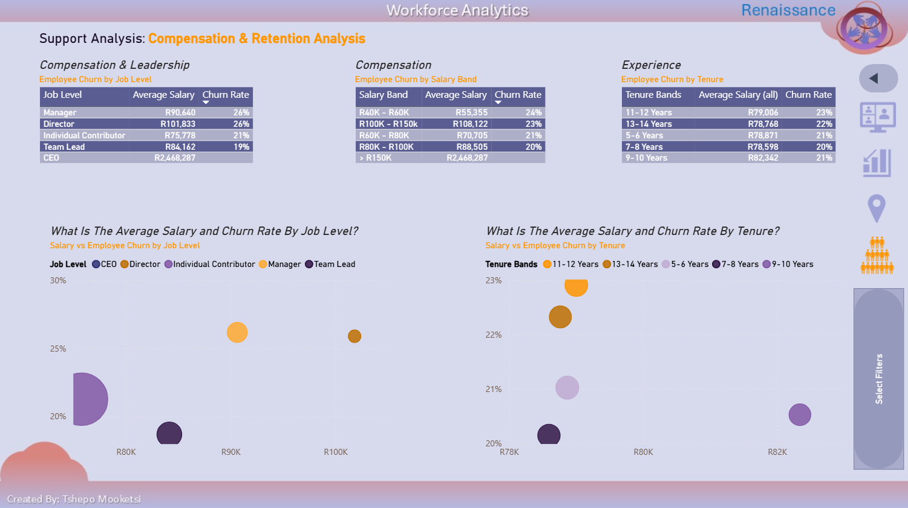

# Human Resources Customer Churn Dashboard 📊
*About Project*
-
This dashboard provides a comprehensive view of workforce performance, employee demographics, workforce composition, remuneration, and employee retention across the organisation. The project uses DAX, data modelling, bookmarks and dynamic buttons for business storytelling by identifying churn drivers and customer retention opportunities. This dashboard analyzes customer churn patterns and identifies factors contributing to customer attrition.

---

## Business Problem

The HR department needs a comprehensive view of workforce performance, employee demographics, remunineration and employee retention across the organisation. 

---

## Dataset

-4 139 Employees from company inception including those that have left the company.  
-A combination of active worfkorce and the company's employment history. 

---

## 1. Key Business Questions

- How many active employees does the organisation have?
- What factors contribute most to employee attrition?
- Does education level influence employee earnings?
- Which workforce demographics earn the highest average salaries?
- Which locations have the highest concentration of remote employees?
- Which job levels and salary bands experience the highest employee churn?
- How is the workforce structured across departments, business units and job levels?

---

## 2. Key Insights 📈
###  2.1.1 Active Workforce 
- Employees with postgraduate qualifications earn the highest average salaries.
- Bachelor's degree holders represent the largest proportion of the workforce.
- Salary varies across education levels, suggesting educational attainment influences earning potential.
- Male employees account for the majority of the workforce.
- Most employees are single.

###  2.1.2 Dashboard Preview 📊

###  2.2.1 Workforce Churn
### Workforce Churn

- Most employee exits are voluntary rather than involuntary.
- The leading drivers of employee turnover are attrition, flexibility and salary-related factors.
- Employee churn peaked in 2014 before declining to its lowest level in 2019.
- Employees identifying as African American have the lowest average salary among the demographic groups analysed.

###  2.2.2 Dashboard Preview 📊

###  2.3.1 Active Workforce Location 
### Workforce Location

- Approximately 80% of employees work remotely.
- Los Angeles has the highest average employee salary.
- Los Angeles operates as a fully on-site workforce, while most other locations are predominantly remote.
- Workforce distribution varies significantly across cities, providing opportunities for location-based workforce planning.

  ###  3.3.2 Dashboard Preview 📊

###  2.4.1 Workforce Composition Analysis
### Workforce Composition

- Workforce composition can be analysed across job level, department, business unit, tenure and individual employee.
- Managers can drill through organisational hierarchies to understand salary distribution across the business.
- The decomposition tree enables rapid identification of high-earning organisational structures.

###  2.4.2 Dashboard Preview 📊

###  2.5.1 Support Analysis: Compensations & Retention Analysis 
- Individual Contributors account for the largest proportion of the workforce and exhibit higher-than-average employee churn.
- Employees earning between R40K and R60K experience the highest turnover, suggesting lower compensation may contribute to retention challenges.
- Employees with 11 or more years of service show the highest churn, indicating a potential retention risk during mid-tenure career stages. 
- Although longer-tenured employees generally earn higher salaries, increased compensation alone does not appear to eliminate employee turnover.

###  2.5.2 Dashboard Preview 📊

### 2.5 Live Dashboard 📊 

*Experience the interactive version of this dashboard in Power BI.*

👉 **[Launch Dashboard](https://app.fabric.microsoft.com/view?r=eyJrIjoiMDBiZWUyNjMtNTVlMS00NWYxLWI2ODMtYTA5NTE2MTNmZTE3IiwidCI6IjJhYTYxN2E4LTI3NDItNDEwMi04NjgzLTFmYTMzZGE4Nzc3YiJ9&embedImagePlaceholder=true)**

--- 
## 3. Top 3 Worforce Insights💡
###  3.1.1 Workforce characteristics have a stronger relationship with employee churn than geography.
- Analysis indicates that employee turnover is more closely associated with job level, salary band, and tenure than with employee location. 
  Individual Contributors, lower salary bands (R40K–R60K), and employees with more than 11 years of service exhibit the highest levels of churn, 
  suggesting retention strategies should focus on workforce segments rather than geographic regions.

###  3.1.2 Compensation alone is not enough to retain employees.

- Although lower-paid employees experience the highest turnover, employees with longer tenure and higher average salaries also demonstrate elevated churn. 
Combined with the exit reason analysis, this suggests that career progression, workplace flexibility, and broader employee experience are key factors influencing retention alongside compensation.

###  3.1.2 Compensation alone is not enough to retain employees.
- Approximately 80% of employees work remotely, with significant variation in salary across cities. 
However, the analysis found no meaningful relationship between city-level average salary and employee churn, indicating that organisational and employee-specific factors are more influential than location 
in explaining workforce turnover.
---

## Author

**Tshepo Mooketsi**

Business Intelligence Analyst with 10 years of experience delivering analytics solutions across the telecoms and retail industries.
Microsoft Certified Power BI Data Analyst Associate (PL-300) with expertise in SQL, Power BI, data warehousing, dashboard development, requirements analysis and stakeholder engagement.

### Skills
- Power BI
- DAX
- Power Query
- Data Modelling
- Business Analysis
- Requirements Gathering
- Data Warehousing (EDW)

### Certifications
- Microsoft Certified: Power BI Data Analyst Associate (PL-300)
- [View Microsoft Certification](link_here)

### Connect With Me
- LinkedIn: [Tshepo Mooketsi](https://www.linkedin.com/in/tshepo-mooketsi-77b892116)
- GitHub: [NSATshepoMooketsi](https://github.com/NSATshepoMooketsi)

---
*Feel free to connect with me to discuss data analytics, business intelligence, and data-driven decision making.*
